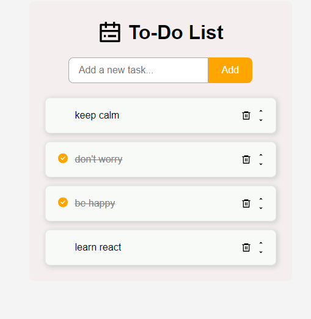

# React To-Do List App

A simple, intuitive, and responsive to-do list application built with React. Manage your daily tasks, mark them as complete, and stay organized!

### Screenshot



## Features

- **Add Tasks:** Easily add new tasks to your to-do list.
- **View Tasks:** See a clear list of all your current tasks.
- **Mark as Complete/Incomplete:** Toggle the completion status of each task.
- **Delete Tasks:** Remove tasks you no longer need.
- **Move Tasks:** Move tasks up and down.
- **Persistent Storage:** Tasks are saved in the browser's LocalStorage, so they persist even after closing the browser.

## Technologies Used

- **React**: A JavaScript library for building user interfaces.
- **Vite**: For fast project setup and development server.
- **JavaScript (ES6+)**: Core programming language.
- **HTML5 & CSS**: For structure and styling.
- **Create React App**: For project setup and development scripts.
- **React-icons**: icon library used for UI elements.

## Prerequisites

Before you begin, ensure you have met the following requirements:

- **Node.js**: Version 16.x or higher (Download from [nodejs.org](https://nodejs.org/))
- **npm** (Node Package Manager) or **yarn**: Usually comes with Node.js.

## Getting Started

Follow these instructions to get a copy of the project up and running on your local machine for development and testing purposes.

### Installation

1.  **Clone the repository:**

    ```bash
    git clone https://github.com/LenaM777/todo-app.git
    ```

2.  **Navigate to the project directory:**

    ```bash
    cd todo-app
    ```

3.  **Install dependencies:**
    Using npm:
    ```bash
    npm install
    ```
    Or using yarn:
    ```bash
    yarn install
    ```

### Running the Application

Once the dependencies are installed, you can run the application:

Using npm:

```bash
npm start
```

Or using yarn:

```bash
yarn start
```

This will start the development server, and the application will automatically open in your default web browser at `http://localhost:3000`. If it doesn't open automatically, navigate to this URL.

## How It Works

The application manages a list of to-do items in the main App component's state. Tasks are stored as an array of objects, each with an id, text, and completed status. Functions to add, toggle, delete, drag-and-drop reordering of tasks are passed down as props to child components (TodoForm, TodoItem). LocalStorage is used to persist the tasks across browser sessions.
